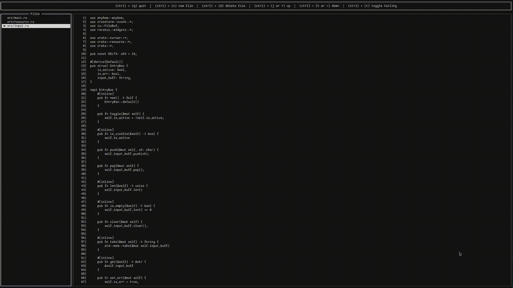

<div>
    <p align="center">
        <picture>
            <source media="(prefers-color-scheme: dark)" srcset="https://raw.githubusercontent.com/Feohr/refer/refs/heads/main/docs/logo/ReferLogoNameDark.svg" height=125px>
            <source media="(prefers-color-scheme: light)" srcset="https://raw.githubusercontent.com/Feohr/refer/refs/heads/main/docs/logo/ReferLogoName.svg" height=125px>
            
        </picture>
        
    </p>
    <p align="center">
        <a href="https://github.com/Feohr/refer/blob/main/LICENSE"></a>
        <a href="https://github.com/Feohr/refer"></a>
        &nbsp;
        &nbsp;
        &nbsp;
        <a href="mailto:mohammedrehaan.work@gmail.com">
            <picture>
                <source media="(prefers-color-scheme: dark)" srcset="https://raw.githubusercontent.com/Feohr/refer/refs/heads/main/docs/social/gmailDark.svg" height=32px>
                <source media="(prefers-color-scheme: light)" srcset="https://raw.githubusercontent.com/Feohr/refer/refs/heads/main/docs/social/gmail.svg" height=32px>
                
            </picture>
        </a>
        <a href="https://github.com/Feohr">
            <picture>
                <source media="(prefers-color-scheme: dark)" srcset="https://raw.githubusercontent.com/Feohr/refer/refs/heads/main/docs/social/githubDark.svg" height=32px>
                <source media="(prefers-color-scheme: light)" srcset="https://raw.githubusercontent.com/Feohr/refer/refs/heads/main/docs/social/github.svg" height=32px>
                
            </picture>
        </a>
        <a href="https://www.linkedin.com/in/mohammed-rehaan-193305222/">
            <picture>
                <source media="(prefers-color-scheme: dark)" srcset="https://raw.githubusercontent.com/Feohr/refer/refs/heads/main/docs/social/linkedinDark.svg" height=32px>
                <source media="(prefers-color-scheme: light)" srcset="https://raw.githubusercontent.com/Feohr/refer/refs/heads/main/docs/social/linkedin.svg" height=32px>
                
            </picture>
        </a>
    </p>
</div>

A TUI app to open, read and tail multiple text files at once. Refer also provides convenient key shortcuts to make navigation simple and fast.</p>



## Installation

Before you start make sure you have rust installed on your system https://www.rust-lang.org/tools/install. Once that is done, then proceed with cloning the repository.

```console
$ git clone --depth=1 git@github.com:Feohr/refer.git
```
Navigate into the `refer` folder and run the release build command.

```console
$ cargo build --release
```

The binary should be present under the target folder `target/release/refer`. Go ahead and save this binary in the system `bin` folder if you wish to.

## Usage

Run directly via the terminal. The binary expects a space separated array of file paths as arguments.

### Key bindings

|       Keys        |                   Action              |
|-------------------|---------------------------------------|
| `ctrl + q`        | quit the app.                         |
| `ctrl + n`        | add a new file.                       |
| `ctrl + d`        | delete a file.                        |
| `(j or ↑)`        | move up the file buffer.              |
| `(k or ↓)`        | move down the file buffer             |
| `ctrl + (j or ↑)` | move to the top of the file buffer.   |
| `ctrl + (k or ↓)` | move to the bottom of the file buffer |
| `ctrl + t`        | toggle tail mode                      |
| `(h or ←)`        | switch to file list                   |
| `(l or →)`        | switch to file buffer                 |
